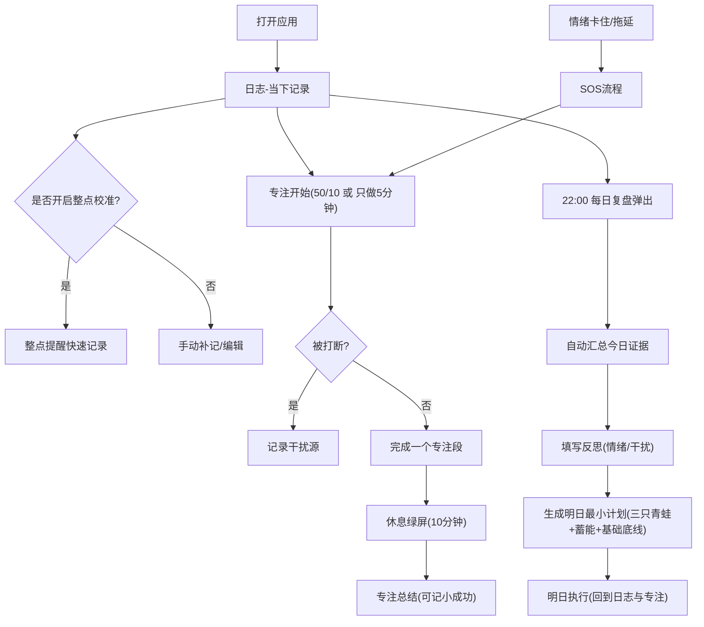

## 1. 产品概述
NOW Flow（当下流）是一款以“NOW主义时间三分法（基础/蓄能/创造）”为底层分类，并以“记录→复盘→计划→执行”为核心闭环的时间管理应用。
- 解决问题：从“瞎忙/低估时间流逝/情绪拖延”转向“可见的时间证据→可复盘的归因→可执行的明日计划”
- 目标价值：让用户用极低阻力持续记录，从而稳定提升创造时间质量，同时守住基础与蓄能的河道底线

## 2. 核心功能

### 2.1 用户角色
| 角色 | 注册方式 | 核心权限 |
|------|----------|----------|
| 普通用户 | 免注册（本地使用）/ 可选账号（后续） | 记录、复盘、计划、专注、情绪工具、统计与提醒 |

### 2.2 功能模块（页面级）
1. **日志（Time Log）**：竖轴时间线记录、三色分类、叠加记录、补记、干扰打点、疯狂闹钟整点校准
2. **复盘（Review）**：每日复盘（22:00触发）、周复盘与趋势、河道警报（基础/蓄能缺失）
3. **计划（Planner）**：明日计划（固定时间桶+任务池+碎片桶）、任务拆解器、三只青蛙、机动时间40%提示
4. **专注（Focus）**：50/10专注、只做5分钟启动、休息绿屏、防打扰护盾文案、专注总结
5. **情绪（Emotion Kit）**：SOS流程（觉知/接纳/If-Then/小成功）、If-Then规则库、小成功历史
6. **设置（Settings）**：提醒与挑战、复盘时间、阈值（基础/蓄能）、数据导出（后续）

### 2.3 页面详情（核心模块与功能说明）
| 页面名称 | 模块名称 | 功能说明 |
|---------|----------|----------|
| 日志-日视图 | 竖轴时间线 | 默认30分钟颗粒度（可缩放至15分钟），展示当日时间块与当前时间指针 |
| 日志-日视图 | 三色汇总胶囊 | 展示🟩/🟨/🟥当日累计时长，点击打开当日统计抽屉 |
| 记录弹层 | 三色选择盘 | 必选主色（基础/蓄能/创造）并选择活动模板，支持“仅选颜色”快速保存 |
| 记录弹层 | 叠加记录 | 同一时间段可叠加2层（如通勤+英语），统计中可单独查看叠加维度 |
| 干扰记录 | 干扰源打点 | 专注中断时快速记录干扰源（人/手机/情绪/环境/其他）供晚间复盘汇总 |
| 疯狂闹钟 | 整点问答 | 新用户默认开启7天挑战，每小时整点提示“刚才1小时做了什么”并快速记录 |
| 每日复盘 | 自动成果摘要 | 自动汇总🟥/🟨时长、Top事项、干扰Top3，作为复盘证据 |
| 每日复盘 | 反思输入 | 引导式模板问题+自由输入，记录情绪与干扰源的主观归因 |
| 每日复盘 | 明日最小计划 | 产出“三只青蛙（1-3）+1个蓄能+基础底线（睡眠）” |
| 周复盘 | 河流趋势 | 按天展示三色比例变化，用“河道”隐喻强化结构性理解 |
| 警报详情 | 干涸提示 | 基础不足/蓄能缺失时页面灰化提示，进入详情页给出可执行补水建议 |
| 明日计划 | 河道容量条 | 显示已排占用%与建议留白40%，超载提示拆小/延后/转碎片桶 |
| 明日计划 | 固定时间桶 | 先放入必须固定时间的事件（会议等） |
| 明日计划 | 碎片时间桶 | 5分钟清单与15分钟清单用于填缝 |
| 任务拆解器 | 目的/预估/标准 | 将大任务拆到可执行下一步动作，降低拖延启动成本 |
| 专注开始 | 50/10与5分钟 | 提供开始50分钟或“只做5分钟”，并生成可复制的防打扰护盾文案 |
| 专注进行中 | 倒计时与暂停 | 支持暂停并记录干扰源，结束后进入总结 |
| 休息绿屏 | 喝水/拉伸/眺望 | 10分钟休息强提示恢复动作，避免滑入刷手机 |
| 情绪首页 | SOS按钮 | 焦虑/不想动时一键进入30-90秒救急流程 |
| SOS流程 | 觉知/接纳/If-Then | 识别情绪→接纳→把触发行为绑定替代动作→记录小成功 |
| If-Then规则库 | 规则管理 | 长期规则启用/停用，支持场景（工作/夜间/通勤） |
| 小成功 | 正反馈 | 用一句话记录微成就，对抗完美主义与自责 |
| 设置 | 通知/复盘时间 | 疯狂闹钟频率、每日复盘时间、警报阈值等 |

## 3. 核心流程
用户使用的主循环：记录（证据）→复盘（洞察）→计划（最小可行）→执行（专注/情绪护航）。

## 4. 用户界面设计

### 4.1 设计风格
- 总体：极简主义、强信息层级、低装饰（用留白与排版形成高级感）
- 三色系统：🟩基础、🟨蓄能、🟥创造为唯一强强调色；其余使用中性色（zinc系）
- 灰化策略：当“基础不足/蓄能缺失”触发警报时，全局降饱和+轻遮罩，不阻断使用
- 字体建议（Web实现可用在线字体或本地回退）：标题用更具个性的中文字体，正文用清晰的无衬线（以可读性为先）
- 动效：关键动作使用少量高质量过渡（弹层、选色盘、专注开始/结束），避免花哨

### 4.2 页面设计概览（UI元素）
| 页面名称 | 模块名称 | UI元素 |
|---------|----------|--------|
| 日志-日视图 | 时间线 | 竖轴时间刻度、时间块卡片、当前时间指针、轻量分隔线与留白 |
| 记录弹层 | 三色选择盘 | 触控友好大按钮、最近活动栅格、叠加徽标、极简输入 |
| 每日复盘 | 三维填空 | 自动摘要卡+引导式问题+最小计划表单，强调“证据→洞察→明日” |
| 明日计划 | 时间桶 | 容量条、固定事件列表、任务池分组、碎片清单、拖拽（可后续） |
| 专注 | 50/10 | 大字号倒计时、暂停/结束、休息绿屏三动作按钮、护盾文案复制 |
| 情绪 | SOS | 4步流程卡片化、枚举优先、可选文本，确保90秒内完成 |

### 4.3 响应式
- 桌面优先：核心视图在桌面宽度下保持信息密度（时间线更长、面板并列）
- 移动适配：弹层与底部Tab优先；时间线支持纵向滚动与快速跳转到“现在”
