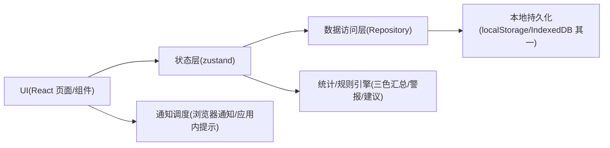
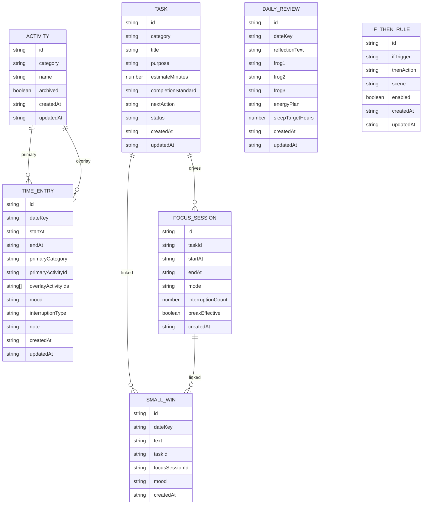

## 1. 架构设计
目标：以纯前端为主（本地数据+可选导出），优先实现“记录→复盘→计划→执行”闭环，后续可平滑扩展账号与云同步。

## 2. 技术说明
- 前端：React@18 + TypeScript + Vite + tailwindcss@3
- 路由：react-router-dom
- 状态管理：zustand（含持久化中间件）
- 图标：lucide-react
- 后端：无（MVP）
- 数据：本地持久化（优先localStorage；若后续需要更大容量与查询，迁移到IndexedDB）

## 3. 路由定义
| 路由 | 目的 |
|------|------|
| / | 入口重定向到 /log |
| /log | 日志（时间线、当下记录、补记与编辑入口） |
| /review | 复盘（每日/每周、警报入口） |
| /planner | 计划（明日计划、时间桶、碎片清单） |
| /focus | 专注（开始、进行中、休息、总结） |
| /emotion | 情绪（SOS、If-Then、小成功） |
| /settings | 设置（通知、复盘时间、阈值等） |

## 4. API 定义
无（MVP为纯前端）。如后续增加云同步，可新增：
- Auth：登录/刷新Token
- Sync：增量同步（TimeEntry/Task/Review等）

## 5. 服务端架构图
无（MVP）。

## 6. 数据模型

### 6.1 数据模型定义
说明：MVP以“时间块记录”为中心；任务、专注、复盘与情绪均可与TimeEntry或Task建立弱关联。

### 6.2 数据定义语言
无（MVP不使用数据库）。如后续增加SQLite/后端，再补DDL。
